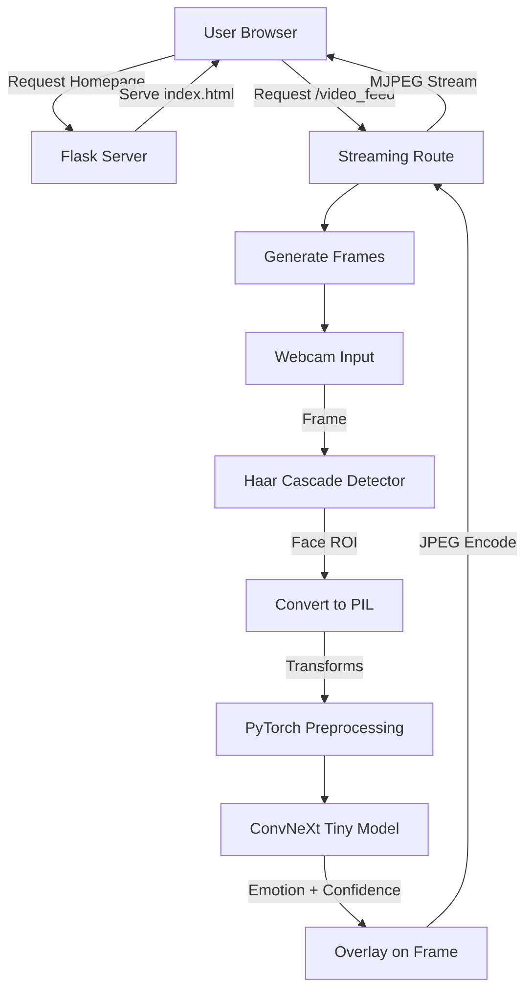

#  Real-Time Emotion Detection – Flask + OpenCV + ConvNeXt

A real-time facial emotion detection system built using Deep Learning (PyTorch), OpenCV, and Flask.
The model identifies emotions directly from your webcam feed, draws bounding boxes, and displays the predicted emotion with confidence scores.
---

## Key Features

- Live webcam feed streamed through Flask
- ConvNeXt Tiny deep-learning model for emotion classification
- Six-emotion recognition (happy, sad, angry, etc.)
- Uses extensive **image augmentation**
- Face detection using Haar Cascade
- Real-time inference using PyTorch
- Web-based interface (index.html)

---

##  Model Overview

- ConvNeXt-Tiny (PyTorch) → trained on the FER2013 dataset
- **Output Layer**: Modified to output 6 classes
- OpenCV Haar Cascade → real-time face detection

##Supported Emotion Classes
  | Label    | Description |
  | -------- | ----------- |
  | angry    | 😠 Angry    |
  | fear     | 😨 Fear     |
  | happy    | 😄 Happy    |
  | neutral  | 😐 Neutral  |
  | sad      | 😢 Sad      |
  | surprise | 😲 Surprise |

## Architecture

